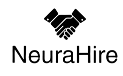

# NueraHire - AI-Powered Recruitment Platform

<div align="center">
  
</div>

NueraHire is an advanced AI-powered job screening system that revolutionizes the recruitment process. It combines cutting-edge technology with user-friendly interfaces to streamline hiring workflows.

## 🤖 How NueraHire is Different

Unlike traditional job portals, NueraHire leverages Generative AI to transform the recruitment process:

### Intelligent Candidate Shortlisting
- **AI-Powered Analysis**: Our system uses advanced NLP to deeply analyze both job descriptions and candidate profiles
- **Contextual Understanding**: Goes beyond keyword matching to understand the context and relevance of skills and experiences
- **Bias Reduction**: AI algorithms are designed to focus on merit and potential, reducing unconscious bias in the hiring process

### Smart Role Matching
- **Dynamic Skill Mapping**: Automatically maps candidate skills to job requirements, even when terminology differs
- **Experience Evaluation**: Analyzes work history to assess true relevance and depth of experience
- **Potential Assessment**: Evaluates transferable skills and growth potential, not just current qualifications

### Automated Insights
- **Detailed Match Reports**: Provides comprehensive analysis of why a candidate is suitable for a role
- **Skill Gap Analysis**: Identifies areas where candidates can improve to better match role requirements
- **Performance Predictions**: Uses historical data to predict candidate success in specific roles

### Enhanced Efficiency
- **Automated Screening**: Reduces manual resume screening time by up to 80%
- **Smart Ranking**: Prioritizes candidates based on multiple factors beyond just keyword matches
- **Continuous Learning**: System improves its matching accuracy over time through machine learning

## 🌟 Key Features

### 1. Job Description Summarization
- AI-powered summarization of job descriptions
- Key requirements extraction
- Skills and qualifications analysis

### 2. Resume Parsing & Analysis
- Automated resume parsing
- Skills extraction and matching
- Experience analysis
- Education verification

### 3. Smart Candidate Matching
- AI-driven candidate-job matching
- Compatibility scoring
- Skills gap analysis
- Cultural fit assessment

### 4. Explainable Insights
- Detailed matching rationale
- Candidate strengths and weaknesses
- Improvement suggestions
- Performance predictions

### 5. Interview Scheduling
- Automated interview scheduling
- Calendar integration
- Reminder system
- Interview feedback management

## 🚀 Getting Started

### Prerequisites
- Node.js (v14 or higher)
- npm or yarn
- Git

### Installation

1. Clone the repository
```bash
git clone https://github.com/yourusername/nuerahire.git
cd nuerahire
```

2. Install dependencies
```bash
npm install
```

3. Start the development server
```bash
npm run dev
```

4. Build for production
```bash
npm run build
```

## 🛠️ Tech Stack

### Frontend (Current)
- React
- TypeScript
- Tailwind CSS
- Vite

### Backend (In Development)
- Node.js/Express (Planned)
- SQLite (Planned)
- Python/NLP (Planned)

## 📄 License

This project is licensed under the MIT License - see the [LICENSE](LICENSE) file for details.

## 📞 Support

For support, please email support@nuerahire.com or open an issue in the GitHub repository.

## 🙏 Acknowledgments

MIT # NueraHire
Nuerahire is an AI-powered job screening system with JD summarization, resume parsing, candidate-job matching, explainable insights, and interview scheduling. It uses multi-agent architecture, NLP, and SQLite for efficient, automated, and modular recruitment workflows.
